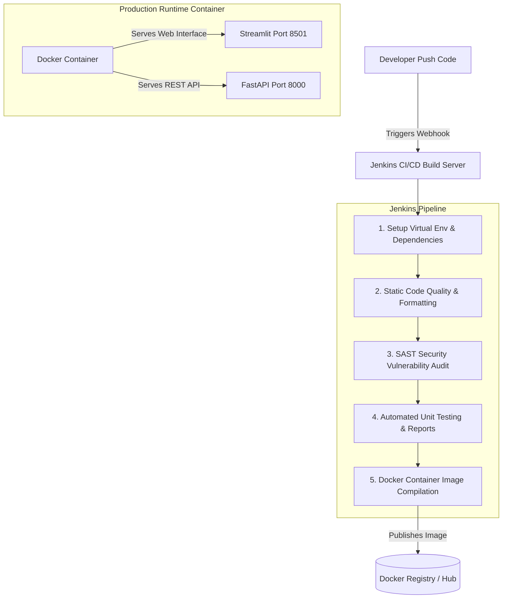

# DevOps Documentation - Jenkins & Docker Integration

This document details the DevOps automation setup utilizing **Docker** for production containerization and **Jenkins** for Continuous Integration/Continuous Deployment (CI/CD) pipelines, including REST API integration.

---

## 🏗️ Architecture Overview

The system is configured as a production-ready application orchestrating modern DevOps practices:
1. **Frontend Web UI**: Single-page Streamlit dashboard (Port `8501`).
2. **Backend REST API**: FastAPI backend with caching and prediction endpoints (Port `8000`).
3. **Containerization**: Optimized multi-stage Docker build packaging application code, dependencies, and startup routing logic.
4. **Pipeline Orchestration**: Jenkins Declarative Pipeline (`Jenkinsfile`) automating virtual environment creation, linting, security scans, unit tests, and Docker compilation.



---

## 🐳 Docker Deployment Guide

The application uses a **secure multi-stage Docker build** executing processes under a non-root system principal (`appuser`).

### Local Compilation & Execution
1. **Build Docker Image**:
   ```bash
   docker build -t sailesh2508/sentiment-analyzer:latest .
   ```
2. **Run Container**:
   ```bash
   docker run -d \
     -p 8501:8501 \
     -p 8000:8000 \
     --name sentiment-analyzer \
     sailesh2508/sentiment-analyzer:latest
   ```
3. **Access Services**:
   * **Streamlit Web UI**: `http://localhost:8501`
   * **FastAPI REST API Docs**: `http://localhost:8000/docs`
   * **FastAPI Health Endpoint**: `http://localhost:8000/health`
4. **Stop Container**:
   ```bash
   docker stop sentiment-analyzer && docker rm sentiment-analyzer
   ```

---

## ⚙️ Jenkins CI/CD Pipeline Setup

The pipeline-as-code is defined in [Jenkinsfile](file:///d:/New%20folder/portifolio/sentiment%20analysis/Jenkinsfile).

### Jenkins Pipeline Job Configuration
1. Open Jenkins Dashboard -> **New Item**.
2. Enter `sentiment-analyzer`, choose **Pipeline**, click **OK**.
3. Under **Pipeline Settings**:
   * **Definition**: `Pipeline script from SCM`
   * **SCM**: `Git`
   * **Repository URL**: `https://github.com/SAILESH2508/SENTIMENT-ANALYSIS.git`
   * **Branch Specifier**: `*/main`
   * **Script Path**: `Jenkinsfile`
4. Click **Save** and trigger build via **Build Now**.

---

## 🔗 Jenkins REST API Integration Client (`trigger_jenkins.py`)

[trigger_jenkins.py](file:///d:/New%20folder/portifolio/sentiment%20analysis/trigger_jenkins.py) enables programmatic interaction with Jenkins via REST API.

### Environment Variable Setup
You can optionally set credentials in `.env` or system environment:
```bash
JENKINS_URL=http://localhost:8080
JENKINS_JOB=sentiment-analyzer
JENKINS_USER=your_username
JENKINS_TOKEN=your_api_token
```

### Usage Commands

1. **Check Latest Build Status**:
   ```bash
   python trigger_jenkins.py --action status
   ```

2. **Trigger Build**:
   ```bash
   python trigger_jenkins.py --user sailesh --token <api_token> --action trigger
   ```

3. **Trigger and Monitor Pipeline Execution**:
   ```bash
   python trigger_jenkins.py --user sailesh --token <api_token> --action monitor
   ```

4. **Fetch Console Output Logs**:
   ```bash
   python trigger_jenkins.py --user sailesh --token <api_token> --action logs
   ```
