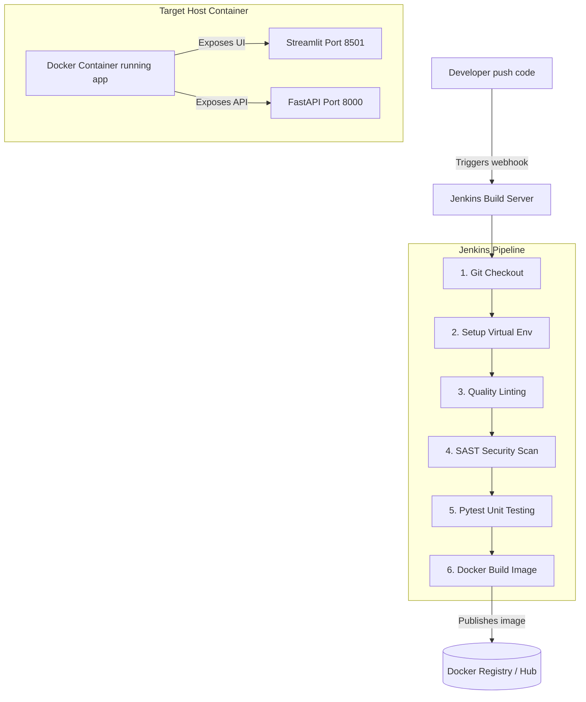

# DevOps Documentation - Jenkins & Docker Integration

This document details the DevOps automation setup utilizing **Docker** for production containerization and **Jenkins** for Continuous Integration/Continuous Deployment (CI/CD) pipelines, including REST API integration.

---

## 🏗️ Architecture Overview

The system is configured as a production-ready application orchestrating multiple DevOps tools:
1. **Frontend UI**: Streamlit web dashboard (Port `8501`).
2. **Backend API**: FastAPI REST endpoints with model caching and health checks (Port `8000`).
3. **Containerization**: Optimized multi-stage Docker build packaging frontend, backend, dependencies, and startup routing logic.
4. **Pipeline Orchestration**: Jenkins Declarative Pipeline (`Jenkinsfile`) automating dependency builds, lint formatting checks, security auditing, testing, and Docker compilation.



---

## 🐳 Docker Deployment Guide

The application uses a **secure multi-stage Docker build** that minimizes build sizes and executes processes under a non-root system principal (`appuser`).

### Local Compilation & Running
1. **Build the Docker Image**:
   ```bash
   docker build -t sentiment-analyzer:latest .
   ```
2. **Run the Container**:
   ```bash
   docker run -d \
     -p 8501:8501 \
     -p 8000:8000 \
     --name sentiment-analyzer \
     sentiment-analyzer:latest
   ```
3. **Access Services**:
   * **Streamlit UI**: `http://localhost:8501`
   * **FastAPI Docs**: `http://localhost:8000/docs`
   * **FastAPI Health Check**: `http://localhost:8000/health`
4. **Clean up**:
   ```bash
   docker stop sentiment-analyzer
   docker rm sentiment-analyzer
   ```

---

## ⚙️ Jenkins CI/CD Pipeline Setup

The pipeline-as-code is defined in the [Jenkinsfile](file:///d:/New%20folder/portifolio/sentiment%20analysis/Jenkinsfile) in the project root.

### Jenkins Pipeline Job Configuration
1. Open Jenkins and click on **New Item**.
2. Enter name `sentiment-analyzer`, select **Pipeline**, and click **OK**.
3. Under the **Pipeline** section in configuration:
   * **Definition**: Select `Pipeline script from SCM`.
   * **SCM**: Select `Git`.
   * **Repository URL**: Enter your Git repository link (e.g. `https://github.com/SAILESH2508/SENTIMENT-ANALYSIS.git`).
   * **Branch Specifier**: Enter `*/main`.
   * **Script Path**: Verify it is set to `Jenkinsfile`.
4. Click **Save** and trigger a build by clicking **Build Now**.

---

## 🔗 Jenkins REST API Client Utility

We have created an integration helper script [trigger_jenkins.py](file:///d:/New%20folder/portifolio/sentiment%20analysis/trigger_jenkins.py) to interact with Jenkins programmatically using the Jenkins API.

### Common CLI Operations

1. **Check Latest Build Status**:
   ```bash
   python trigger_jenkins.py --url http://localhost:8080 --job sentiment-analyzer --action status
   ```

2. **Trigger a New Build**:
   ```bash
   python trigger_jenkins.py --url http://localhost:8080 --job sentiment-analyzer --user sailesh --token <your-api-token> --action trigger
   ```
   *(Note: API tokens can be generated in Jenkins under your User profile ➡️ Configure ➡️ API Tokens).*

3. **Stream Console Build Logs**:
   ```bash
   python trigger_jenkins.py --url http://localhost:8080 --job sentiment-analyzer --action logs
   ```

4. **Trigger Build and Monitor Real-Time Log Output**:
   ```bash
   python trigger_jenkins.py \
     --url http://localhost:8080 \
     --job sentiment-analyzer \
     --user sailesh \
     --token <your-api-token> \
     --action monitor
   ```
   This command schedules the build, polls the status API until completion, and prints the console text trace automatically.
