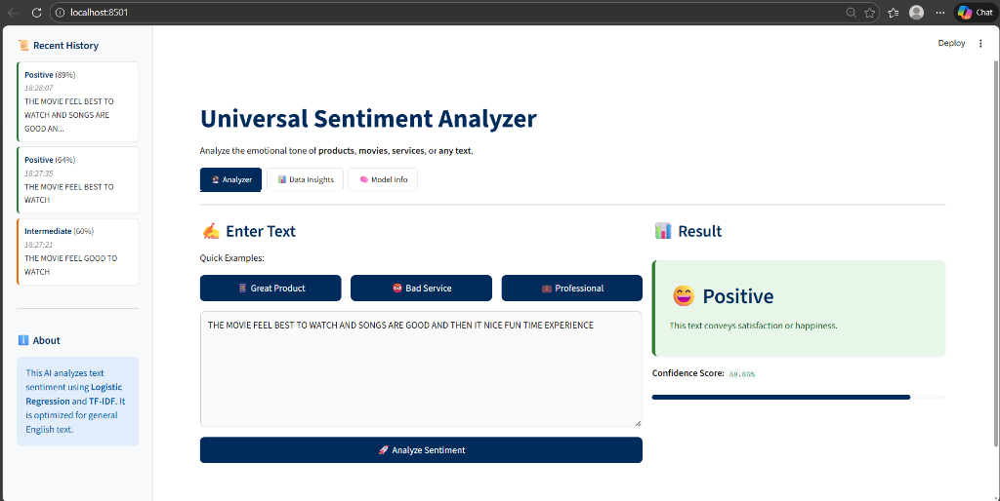

# Universal Sentiment Analyzer v2.0

[](Jenkinsfile)
[](Dockerfile)

A production-ready machine learning application that predicts sentiment (Positive, Negative, or Intermediate) with advanced caching, monitoring, and API capabilities. Built with Python, Scikit-learn, FastAPI, and Streamlit.



## 🚀 Features

### Core Analysis
*   **Universal Analysis**: Works on product reviews, social media posts, general feedback, and more
*   **Three-Tier Sentiment**: Classifies text as **Positive**, **Negative**, or **Intermediate** (neutral/mixed)
*   **Input Validation**: Intelligent rejection of nonsense or extremely short inputs
*   **Multilingual Support**: Supports 50+ languages via auto-translation to English

### User Interface
*   **Interactive Streamlit UI**: Modern, responsive dashboard with Dark Blue/White theme
*   **Bulk Analysis**: Upload CSV/TXT files to analyze thousands of reviews with visualizations
*   **URL Analyzer**: Analyze sentiment of web pages and articles
*   **Text Comparison**: Compare sentiment of two texts side-by-side
*   **Word Clouds**: Generate visualizations of frequent positive/negative words
*   **Data Insights**: Visualize training data distribution and model performance

### Production Features (NEW in v2.0)
*   **FastAPI REST API**: Production-ready API with automatic documentation
*   **Intelligent Caching**: TTL-based prediction caching for improved performance
*   **Performance Monitoring**: Comprehensive analytics and anomaly detection
*   **Configurable Thresholds**: YAML-based configuration for all parameters
*   **Comprehensive Logging**: Structured logging with prediction tracking
*   **Batch Processing**: Efficient processing of multiple texts
*   **Health Checks**: API health monitoring and model status endpoints
*   **Error Handling**: Robust error handling with detailed error messages

## 🏗️ Architecture

```
┌─────────────────┐    ┌──────────────────┐    ┌─────────────────┐
│   Streamlit UI  │    │   FastAPI REST   │    │  Monitoring &   │
│                 │    │      API         │    │   Analytics     │
└─────────┬───────┘    └─────────┬────────┘    └─────────┬───────┘
          │                      │                       │
          └──────────────────────┼───────────────────────┘
                                 │
                    ┌────────────▼────────────┐
                    │  Enhanced Inference     │
                    │      Service            │
                    │  (Caching + Logging)    │
                    └────────────┬────────────┘
                                 │
                    ┌────────────▼────────────┐
                    │   ML Pipeline           │
                    │ TF-IDF + Logistic Reg   │
                    └─────────────────────────┘
```

## 🚀 Quick Start

### Option 1: Automated Setup (Recommended)
```bash
git clone <repository-url>
cd sentiment-analysis
python setup.py
```

### Option 2: Manual Setup
1.  **Install dependencies**:
    ```bash
    pip install -r requirements.txt
    ```

2.  **Prepare data and train model**:
    ```bash
    python eda.py          # Download and process IMDB dataset
    python model_trainer.py # Train the model
    ```

3.  **Run the application**:
    ```bash
    # Streamlit UI
    streamlit run app.py
    
    # Or FastAPI server
    python api.py
    ```

## 🔧 Configuration

The application uses `config.yaml` for all configuration:

```yaml
model:
  thresholds:
    intermediate_lower: 0.40  # Configurable sentiment thresholds
    intermediate_upper: 0.60
    
performance:
  cache_predictions: true     # Enable/disable caching
  cache_ttl_seconds: 3600    # Cache time-to-live
  
logging:
  log_predictions: true      # Enable prediction logging
  level: "INFO"
```

## 📊 API Usage

### Start the API Server
```bash
python api.py
# API available at http://localhost:8000
# Interactive docs at http://localhost:8000/docs
```

### Example API Calls

**Single Prediction:**
```bash
curl -X POST "http://localhost:8000/predict" \
  -H "Content-Type: application/json" \
  -d '{"text": "This movie is amazing!"}'
```

**Batch Prediction:**
```bash
curl -X POST "http://localhost:8000/predict/batch" \
  -H "Content-Type: application/json" \
  -d '{"texts": ["Great movie!", "Terrible film.", "It was okay."]}'
```

**File Upload:**
```bash
curl -X POST "http://localhost:8000/predict/file" \
  -F "file=@reviews.csv"
```

## 📈 Monitoring & Analytics

### Performance Monitoring
```bash
python monitoring.py  # Generate performance report
```

### API Endpoints for Monitoring
- `GET /health` - Health check and model status
- `GET /analytics/report` - Performance analytics
- `GET /analytics/anomalies` - Anomaly detection
- `GET /model/info` - Model information
- `POST /cache/clear` - Clear prediction cache

### Key Metrics Tracked
- Prediction volume and patterns
- Confidence score distributions
- Text length statistics
- Hourly/daily usage patterns
- Anomaly detection (confidence spikes, sentiment skew)

## 🧪 Testing

Run the comprehensive test suite:
```bash
python -m pytest test_sentiment_analyzer.py -v
```

Tests cover:
- Text preprocessing and validation
- Prediction accuracy and caching
- Batch processing
- Performance monitoring
- API endpoints
- Error handling

## 🛡️ DevOps & CI/CD Pipeline

This repository is configured as an automated DevOps project utilizing Jenkins Pipelines and Docker containerization.

For detailed guides, please see:
* **[DevOps Guide (DEVOPS.md)](DEVOPS.md)**: Instructions on local execution, virtual environments, CI quality checks, Docker containerization, and Jenkins REST API client usage.
* **[Jenkins Pipeline Configuration (Jenkinsfile)](Jenkinsfile)**: Jenkins Pipeline script declaring formatting checks, static security audits, test runs, and Docker image builds.
* **[Jenkins REST API client (trigger_jenkins.py)](trigger_jenkins.py)**: Python CLI tool to trigger builds and stream console outputs programmatically.

## 🌐 Deployment to Streamlit Cloud

This project is ready for one-click deployment!

1.  **Push to GitHub**: Ensure your code (including `requirements.txt` and `sentiment_pipeline.pkl`) is on GitHub.
2.  **Sign up/Login**: Go to [Streamlit Cloud](https://streamlit.io/cloud).
3.  **New App**: Click "New app".
4.  **Connect Repo**: Select this repository, branch `main`, and main file `app.py`.
5.  **Deploy**: Click "Deploy"!

**Note**: The model file `sentiment_pipeline.pkl` (~87MB) is included in the repo to ensure fast startup on the cloud.

## 📂 Project Structure

*   `app.py`: Main Streamlit application.
*   `inference_service.py`: Logic for prediction and validation.
*   `model_trainer.py`: Script to train the Logistic Regression model.
*   `eda.py`: Exploratory Data Analysis and data splitting.
*   `download_data.py`: Helper to download the dataset.
*   `requirements.txt`: Python dependencies.

## 🧠 Model Details

*   **Algorithm**: Logistic Regression.
*   **Vectorization**: TF-IDF (Term Frequency-Inverse Document Frequency).
*   **Training Data**: 50,000 IMDB Movie Reviews (Generalizes well to English sentiment).
*   **Accuracy**: ~90% on test set.
